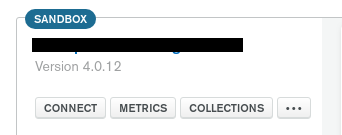
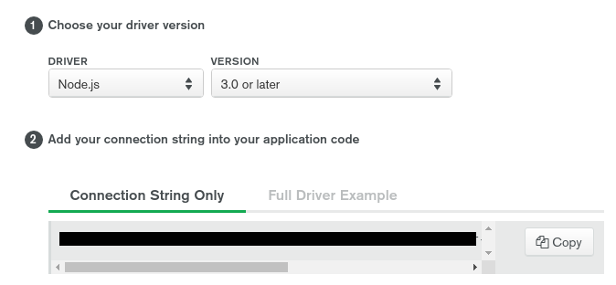

# Event Booking Web App

Simple event booking application written in Node.js with Express and React.js, with storage in MongoDB

## Install Instructions (The Docker way)
1. Install [Docker](https://docs.docker.com/install/) and [Docker Compose](https://docs.docker.com/compose/install/).
2. Change the connection URL for mongoose in [index.js](./index.js) to the relevant URL in the docker container
    1. `mongodb://mongo:27017/bookings-db`
    2. For Linux users, note that docker commands need to be run with `sudo`
3. Wait for docker containers to download/spin up. Localhost port 3000 is for the node application, and port 27017 is for MongoDB

## Install Instructions (DB on Local Machine)
1. Install [MongoDB](https://www.mongodb.com/download-center/community)
2. Go to your terminal and run `mongod` to start the MongoDB daemon.
3. Change the connection URL for mongoose in [index.js](./index.js) to the relevant URL for your computer
    1. Most likely will be `mongodb://localhost:27017/bookings-db`

## Install Instructions (Cloud DB through MongoDB Atlas)
1. Install [Node.js](https://nodejs.org/en/) (which should also install npm)
2. Change the connection URL for mongoose in [index.js](./index.js) to consume a environment variable
    1. This is done for security reasons, change it to `${process.env.MONGO_URL}`
3. This project will connect to a MongoDB Atlas database, and you will need to configure your project to connect to one to (local MongoDB to be added in the future). 
    1. Visit the MongoDB Atlas [Getting Started Page](https://docs.atlas.mongodb.com/getting-started/)
    2. Follow the instructions to create a free cluster and create an admin user or a user with read/write priviledges (note: remember to save the password somewhere safe).
4. In your clusters view, select "Connect" 
    1. <br />

5. Select "Connect Your Application" and then copy the connection string to your database
    1. <br />

6. Create a new file in the project root directory called `nodemon.json`. This will hold the environment variables for the node application to connect to your MongoDB cluster.
7. Copy this code snippet into `nodemon.json`.
```
{
    "env": {
        "MONGO_URL": ${MONGO_CONNECTION_STRING}
    }
}
```
where you replace the username, password, and collection name with the relevant MongoDB user you created in step 3ii. The collection name should be the name of the collection you wish to store the data into. In the end, this string should look similiar to: `mongodb+srv://${MONGO_USERNAME}:${USER_PASSWORD}@${NAME_OF_CLUSTER}.mongodb.net/${COLLECTION_NAME}?retryWrites=true&w=majority`

8. Run `npm start`

## NPM Package Explanation
- [bcrypt.js](https://www.npmjs.com/package/bcryptjs) - Security package for storing sensitive information
- [Body-Parser](https://www.npmjs.com/package/body-parser) - Middleware to parse body of HTTP requests
- [Express](https://www.npmjs.com/package/express) - Web application framework for Node.js
- [Express-GraphQL](https://www.npmjs.com/package/express-graphql) - Express server to handle GraphQL queries
- [GraphQL](https://www.npmjs.com/package/graphql) - JS Implementation of GraphQL
- [JsonWebToken](https://www.npmjs.com/package/jsonwebtoken) - To generate JWTs for user authentication
- [Mongoose](https://www.npmjs.com/package/mongoose) - Library to add MongoDB drivers and enables object modeling through JS objects

#### Dev modules
- [ESLint](https://www.npmjs.com/package/eslint) - Linting Program
- [Husky](https://www.npmjs.com/package/husky) - Git Hooks
- [Nodemon](https://www.npmjs.com/package/nodemon) - Automatically restarts server upon file changes


Taken and modified from this [GraphQL Tutorial](https://www.youtube.com/watch?v=7giZGFDGnkc&list=PL55RiY5tL51rG1x02Yyj93iypUuHYXcB_&index=1)